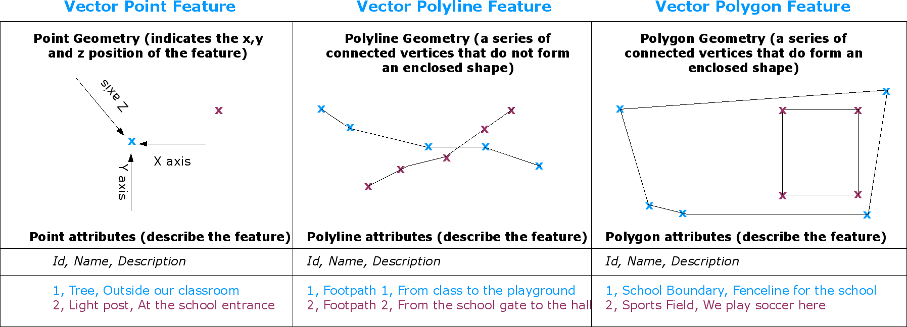
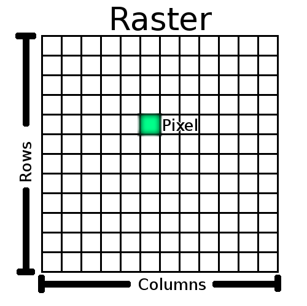
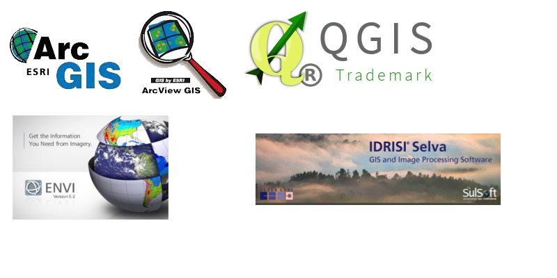
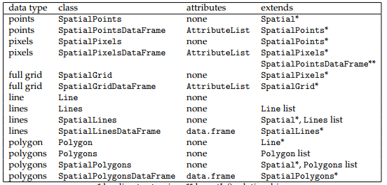
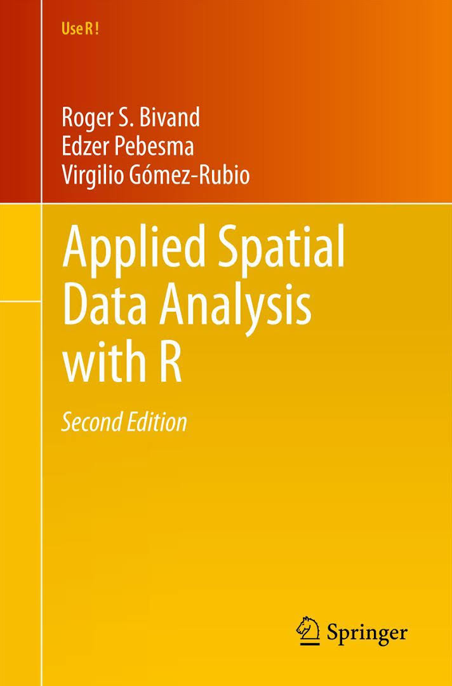
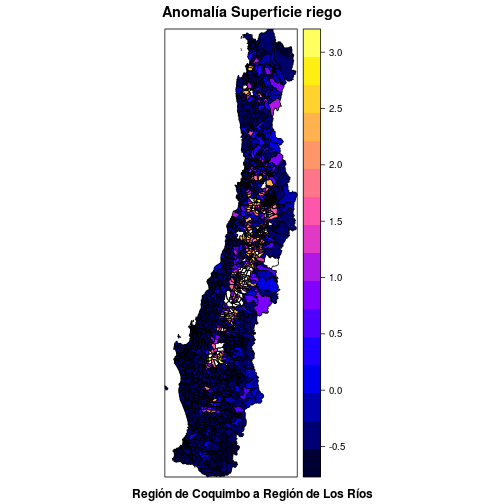
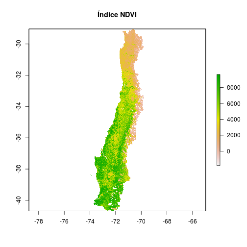
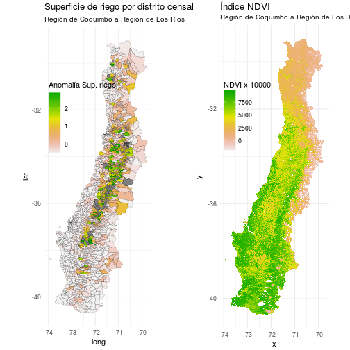

## Background

<!-- >- Trabajo relacionado a la agricultura y los recursos hídricos -->
<!-- >- UdeC, CNR, INDAP, DGA, INIA -->
<!-- >- Indicador de sequía agrícola (VCI) -->
<!-- >- Inicio doctorado año 2013 -->
<!-- >- Linea de investigación: Sequía agrícola en Chile -->

<div style='text-align: center;'>
 
</div>


---.segue bg:grey

# I Información geo-espacial

---

## ¿Qué son datos geo-espaciales?

`Espacial`: Datos que tienen un lugar en el espacio (ej. posición, x,y,z)  

`Geo-espacial`: Datos que tiene una posición geográfica (ej. latitud, longitud)

## ¿Por qué son importantes?

- La mayoria de las actividades humanas estan directa o indirectamente vinculadas a la localización geográfica.
- ~80% de los datos tienen una componente de localización.

<div style='text-align: center;'>
 
</div>

---&twocol

## Tipos de datos geo-espaciales

*** =left

`Vectorial`: Formas simples de representación por geometrías. Puntos, lineas, poligonos.  

<div style='text-align: center;'>
 
</div>

`Raster`: Representación con datos grillados.   

<div style='text-align: center;'>
 
</div>

*** =right

<div style='text-align: center;'>
 
</div>


---

## Sistemas de Información Geográfica (SIG)

- SIG: Herramientas que integran y permiten la organización, almacenamiento, manipulación, análisis y modelización de grandes cantidades de datos geoespaciales.

<div style='text-align: center;'>
 
</div>


---.segue bg:grey

# R como Sistema de Información Geográfica (SIG)

---

## Paquete `sp`  

- Hasta antes del 2005 `R` no tenía soporte para manejo y análisis de información `geo-espacial`.


<iframe src="https://cran.r-project.org/web/packages/sp/index.html" width=100% align="right" allowtransparency="true"> </iframe>

---

## Paquete `sp`  

> Pebesma, E.J., R.S. Bivand, 2005. Classes and methods for spatial data in R. R
  News 5 (2)[https://cran.r-project.org/doc/Rnews/Rnews_2005-2.pdf](https://cran.r-project.org/doc/Rnews/Rnews_2005-2.pdf)

<div style='text-align: center;'>
 
</div>

---&twocol

## Análisis geo-espacial

*** =left

- Roger S. Bivand, Edzer Pebesma, Virgilio Gomez-Rubio, 2013. [Applied spatial data analysis with R, Second edition. Springer, NY].(http://www.asdar-book.org/)
- Primera publicación el año 2008.

*** =right

<div style='text-align: center;'>
 
</div>

---&twocol

## Análisis geo-espacial

*** =left

**Principales paquetes**

- `maptools`: manejo de datos vectoriales ESRI shapefiles (.shp).  
Roger Bivand and Nicholas Lewin-Koh (2017). maptools: [Tools for Reading and Handling Spatial Objects. R package version 0.8-41](https://CRAN.R-project.org/package=maptools)
  
- `raster`: series temporales de datos grillados geo-espaciales.  
Robert J. Hijmans (2016). raster: [Geographic Data Analysis and Modeling. R package version 2.5-8](https://CRAN.R-project.org/package=raster)


*** =right

**Dependencias de sp**


```
## IGRAPH DN-- 94 93 -- 
## + attr: name (v/c), relation (e/c), color (e/c)
## + edges (vertex names):
##  [1] CAMAN             ->sp DeducerSpatial    ->sp DivE              ->sp
##  [4] ENiRG             ->sp FedData           ->sp FeedbackTS        ->sp
##  [7] GISTools          ->sp GWmodel           ->sp Grid2Polygons     ->sp
## [10] INLABMA           ->sp KappaV            ->sp MBA               ->sp
## [13] MUCflights        ->sp MapGAM            ->sp MetaLandSim       ->sp
## [16] RandomFields      ->sp RapidPolygonLookup->sp SPODT             ->sp
## [19] SSN               ->sp SpatialEpi        ->sp UScensus2000cdp   ->sp
## [22] UScensus2000tract ->sp UScensus2010      ->sp Watersheds        ->sp
## + ... omitted several edges
```

---&twocol

## Análisis geo-espacial

*** =left

**Principales paquetes**

- `gstat`: análisis geo-estadístico espacio-temporal.  
Pebesma, E.J., 2004. Multivariable geostatistics in S: the gstat package.Computers & Geosciences, 30: 683-691.  

*** =right

<div style='text-align: center;'>
 
</div>

---

## Visualización con `maptools` y `raster`


```r
library(maptools)
shp <- readShapePoly('spatial_data/vectorial/riegominis_r4_r14.shp',proj4string=CRS("+proj=longlat +datum=WGS84"))
shp@data$sup_riego <- scale(shp@data$sup_riego)
shp@data$sup_riego[shp@data$sup_riego>3] <- NA

library(raster)
ndvi <- raster('spatial_data/raster/NDVI.tif')
```

---&twocol

## Visualización con `maptools` y `raster`

*** =left

sp::spplot(shp,zcol='sup_riego')



*** =right

raster::plot(ndvi)



---

## Visualización con `ggplot2`


```r
library(ggplot2)

#Superficie de riego (Vectorial)
shp.f <- ggplot2::fortify(shp,region='coddis')
p1 <- ggplot() +
  geom_map(data=shp@data,aes(map_id = coddis,fill=as.numeric(sup_riego)),colour=NA,map = shp.f,size=0.05) +
  geom_polygon(data=shp.f,aes(x=long,y=lat,group=group),color='black',fill=NA)+
  scale_fill_gradientn('Anomalía Sup. riego',colours = rev(terrain.colors(10)))+
  labs(title='Superficie de riego por distrito censal',
  subtitle='Región de Coquimbo a Región de Los Ríos')+
  coord_equal()+
  theme_minimal()+
  theme(legend.position=c(.25,.7))
```

---

## Visualización con `ggplot2`


```r
# NDVI (raster)
ndvi.p <- data.frame(raster::rasterToPoints(ndvi))

p2 <- ggplot(NULL, aes(x, y)) +
  geom_raster(data = ndvi.p, aes(fill = NDVI)) +
  scale_fill_gradientn('NDVI x 10000',colours = rev(terrain.colors(10)))+
  labs(title='Índice NDVI',
  subtitle='Región de Coquimbo a Región de Los Ríos')+
  coord_equal()+
  theme_minimal()+
  theme(legend.position=c(.25,.7))
```

---

## Visualización con `ggplot2`


```r
library(gridExtra)
gridExtra::grid.arrange(p1,p2,nrow=1)
```



---

## Visualización y edición interactiva

- `leaflet`: crea mapas dinámicos con la libreria `leaflet` de JavaScript
Joe Cheng, Bhaskar Karambelkar and Yihui Xie (2017). leaflet: [Create Interactive Web Maps with the JavaScript 'Leaflet' Library. R package version 1.1.0.](https://CRAN.R-project.org/package=leaflet)

- `mapview`:  métodos para visualizar objetos geo-espaciales en forma dinámica.
Tim Appelhans, Florian Detsch, Christoph Reudenbach and Stefan Woellauer (2017). [mapview: Interactive Viewing of Spatial Objects in R. R package version 2.1.4.](  https://CRAN.R-project.org/package=mapview)

- `mapedit`: edición interactiva de objetos geo-espaciales. 
Tim Appelhans and Kenton Russell (2017). mapedit: Interactive Editing of Spatial Data in R. [R package version 0.3.6.](https://github.com/r-spatial/mapedit)

---

## Visualización y edición interactiva

**mapview**

<!-- ```{r echo=FALSE,warning=FALSE,message=FALSE} -->
<!-- library(mapview) -->
<!-- m <- mapview(shp,color = "black") -->
<!-- library(htmlwidgets) -->
<!-- mapshot(m, file="mapview.html") -->
<!-- m2 <- m %>% editMap() -->
<!-- ``` -->

<iframe src="mapview.html" width=100% align="right" allowtransparency="true"> </iframe>

---.segue bg:grey

# Aplicaciones

---

## Investigación sobre la sequía agrícola en Chile.

**Integración con otros paquetes**

`Paquetes geoespaciales` + `tidyverse` + `knitr` + ...

- Utilizando datos públicos raster espacio-temporales del estado de la vegetación y la precipitación (MODIS, CHIRPS, TRMM, PERSIANN).(`raster`)
- Datos de precipitación de estaciones meteorológicas. (`vectorial`)
- Información del censo agropecuario 2007 (`INE, 2007`) (`vectorial`)

---

## Desarrollo de aplicaciones shiny

<iframe src="https://frzambra.shinyapps.io/drought_prediction/" width=100% align="right" allowtransparency="true"> </iframe>

---

## Presente y futuro para datos geo-espaciales con R

- `sf`: simple features, sucesor del paquete `sp`.  
Edzer Pebesma (2017). sf: Simple Features for R. [R package version 0.5-4.](https://CRAN.R-project.org/package=sf)

- `stars`: spatiotemporal tidy arrays for R. Sucesor de `raster`. [En desarrollo] (https://github.com/r-spatial/stars).

<iframe src="https://github.com/r-spatial/stars" width=100% align="right" allowtransparency="true"></iframe>

---

## Información de contacto

- Presentación creada con [slidify](http://slidify.org/) y disponible en:  
[https://frzambra.github.io/defensa_tesis_doctorado/](https://frzambra.github.io/defensa_tesis_doctorado/)
- twitter: [@frzambra](www.twitter.com/frzambra)
- Linkedin: [www.linkedin.com/in/frzambra](www.linkedin.com/in/frzambra)
- ORCID: [0000-0001-6896-8534](https://orcid.org/0000-0001-6896-8534)
- publons: [publons.com/a/1258057/](publons.com/a/1258057/)
- email: [frzambra@gmail.com](mailto:frzambra@gmail.com)

---
